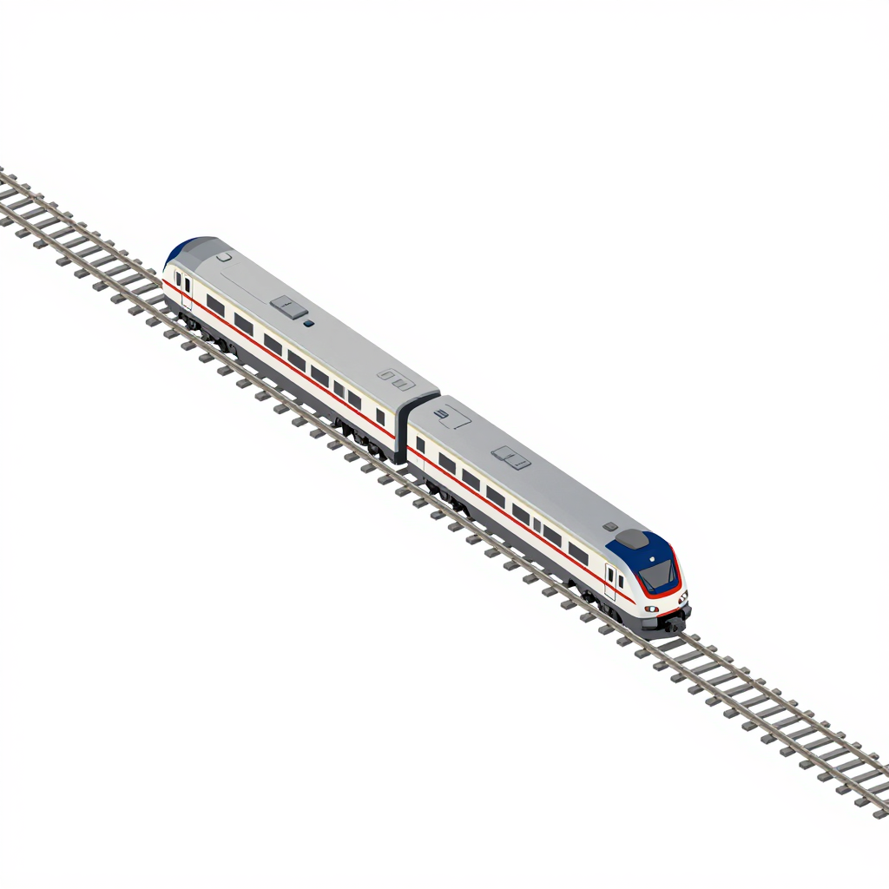

<div align="center">
  

  <br />
  <br />

  <strong>
    The toolkit that turns a codebase from AI-assisted to autonomy ready
  </strong>
  <br />
</div>

**Autonomy rails** helps engineering teams to make their codebases ready for autonomous software development.

As AI coding agents become more capable, the bottleneck is not just code generation, it is verification. Most software systems were designed for human-driven workflows, with implicit knowledge, inconsistent tests, fragile CI, unclear ownership, and limited machine readable intent. **Autonomy rails** provides a set of agent plugins that help teams turn those codebases into environments where AI agents can operate safely, incrementally, and with measurable confidence. Just install the plugins in any AI assistant that supports the plugin standard (Cursor, Claude Code, Codex), and you're ready to go.

The goal is to help teams move from AI-assisted coding to verified autonomous software workflows, one codebase and one validation layer at a time.

## Getting started

### Installation

Install the plugins in your AI agent:

**Claude Code:**

Add the marketplace

```bash
/plugin marketplace add krokoko/autonomy-rails
```

Add the plugins

```bash
/plugin install codebase-ai-readiness@autonomy-rails
/plugin install software-verification@autonomy-rails
```

**Codex:**

1. Clone this repository locally.
2. Open the repo in Codex so it discovers `.agents/plugins/marketplace.json`.
3. Restart Codex, open the plugin directory, choose the **Autonomy Rails** marketplace, and install a plugin.

Claude-specific PostToolUse hooks are not wired into Codex manifests; skills and references work the same.

**Cursor:**

Install plugins from a marketplace that indexes this repo, or copy skills into your project's agent configuration per Cursor's plugin documentation.

### Usage

Once installed, use the skills via slash commands in your AI agent:

```text
/assess-readiness              # Assess codebase AI readiness
/generate-roadmap              # Generate improvement roadmap
/assess-verification           # Assess verification maturity
/design-strategy               # Design verification strategy
/detect-ai-smells              # Assess AI smell detection gates
```

### Recommended workflow

For a full autonomy readiness pass on a codebase:

1. `/assess-readiness` → `readiness-report.md`
2. `/generate-roadmap` → `readiness-roadmap.md`
3. `/assess-verification` → `verification-report.md`
4. `/design-strategy` → `verification-strategy.md`
5. `/detect-ai-smells` → `ai-smells-gates-report.md`

Or use natural language triggers:

- "How AI-friendly is this codebase?"
- "What should I improve for AI readiness?"
- "What verification do I need?"
- "Design a verification strategy for this module"

## Levels of autonomy

We consider the following levels of autonomy:

| Level | Meaning |
| ----- | ------- |
| L0 | **Human only.** AI can explain code but should not modify it. |
| L1 | **Assisted.** Humans own design and implementation; AI suggests or drafts fragments. Changes are verified mainly by the author; little machine-readable intent or agent-safe structure. |
| L2 | **Reviewed.** Agents may touch the codebase in limited ways, but meaningful changes expect explicit human review before merge. CI exists but may be flaky or incomplete relative to risk. |
| L3 | **Bounded iteration.** Agents can iterate inside clear guardrails (e.g. scoped tasks, green tests, typed boundaries) with selective human review on higher-risk surfaces. Verification is stronger but not exhaustive. |
| L4 | **Verified autonomy.** Automated checks (tests, types, lint, policy, environments) are the primary gate; humans focus on intent, architecture, and exceptions. Most routine changes can ship when the verification stack passes. |
| L5 | **End-to-end autonomous.** Machine-readable requirements and strong oracles cover the system so agents can plan, implement, and validate work across the stack with confidence comparable to a mature human team on routine evolution—humans set goals and govern edge cases. |

## Available plugins

### Layer 1: diagnose

These plugins assess current readiness and provide recommendations to move to the next level of autonomy

#### Codebase AI readiness plugin

This plugin helps to answer the following question: "how AI friendly is my codebase, and what can I do to unlock more autonomy ?"

Most companies are not ready for autonomous coding. Their codebases often lack clear structure, consistent docs, testable boundaries, reliable CI, strong typing, deterministic environments and deployment, and explicit architecture decisions.

This plugin reviews an existing codebase and produces an autonomy maturity map.

The output includes a numeric score, a category breakdown of the findings, a recommended autonomy level, and the list of blockers for moving towards the next level of autonomy along with a roadmap of recommended actions.

#### Software verification plugin

This plugin helps to answer the following question: "given this codebase, these components, and these risks, what is the verification strategy that would unlock more autonomy ?".

The output is a maturity of the current verification strategy, breakdown of components in the codebase with a recommended verification path for each one of them, missing oracles, insights on where exact correctness is possible, where only statistical/empirical validation is realistic, recommendations on which components require human review, which parts are candidate for autonomous agent iteration.

### Coming soon

#### Organization readiness plugin (Layer 1: diagnose)

A codebase can be technically ready for autonomy (L4) while the team around it remains stuck at individual tooling. This plugin will assess **organizational readiness** for agentic workflows — covering review process bottlenecks, knowledge accessibility, and feedback loop completeness.

It will help answer: "Is my team structured to absorb the output of autonomous agents, or will increased agent throughput just pile up in review queues?"

Assessment dimensions will include:

- **Review gate design** — where humans are in the loop today, and whether those gates are positioned for high-value judgment vs. rubber-stamping
- **Knowledge accessibility** — whether decisions, specs, and context are machine-readable and travel with the work (vs. trapped in Slack/meetings)
- **Feedback routing** — whether CI/verification results flow back into agent re-execution or terminate in human-only dashboards
- **Adoption maturity** — individual tooling, team-scale orchestration, or org-scale platform

## Contributing

Big shout out to our awesome contributors! Thank you for making this project better!

Contributions of all kinds are welcome! See [CONTRIBUTING.md](./CONTRIBUTING.md).

## Developer guide

If you want to add a new plugin to the library, check out our [design guidelines](./docs/DESIGN_GUIDELINES.md) and [development guide](./docs/DEVELOPMENT_GUIDE.md).

## License

This project is licensed under the [Apache-2.0 License](./LICENSE).
